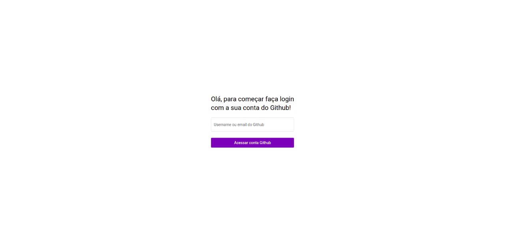
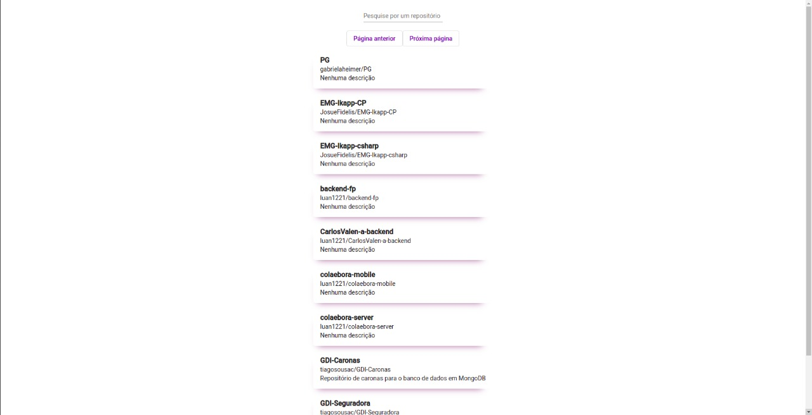

# Cloudfront link

Link do Cloudfront: http://dzw3hhbdwxf7e.cloudfront.net/ 

# Rotas

Na rota raiz, se encontra a tela de login, onde o usuário pode passar previamente o username do Github que se deseja fazer login

A rota /profile contém as informações básicas sobre o Github que se fez o login, como a foto do perfil e a bio.

A rota /repositories contém a lista de repositórios, públicos e privados, do usuário logado. Contendo também a paginação que está fazendo uso da API.

# Dificuldades

## Uso do RxJs
Não consegui, no tempo dado, passar o tratamento das requisições para o uso com RxJs. Meu planejamento era fazer isso após o sistema estar funcionando, pois é algo que não tenho o conhecimento necessário para começar fazendo. Logo, minha premissa era fazer a refatoração no final.

## Problema com o CORS do Angular
Além disso, passei uma parcela muito grande do tempo buscando solução de um erro ao fazer um POST para obtenção do OAUTH_TOKEN, da API do Github. O problema era que no Angular, por padrão, o CORS bloqueia certas operações na rede. Resolvi fazendo um proxy.

## Hospedagem do S3 + Cloudfront
Um outro problema foi a hospedagem do Amazon Cloudfront que estava dando 403, e passei um tempo vendo se isso era por causa do Amazon S3, cujo usei para armazer a build.
Eu consegui hospedar o site mas o bucket do Amazon S3 bloqueia requisições POST de outra origim, logo, não é possível fazer login pela hospedagem. Mas, clonando o repositório e testando, é possível utilizar todas as funcionalidades implementadas.

# Telas

## Tela de Login

## Tela de Perfil

## Tela de Repositórios

